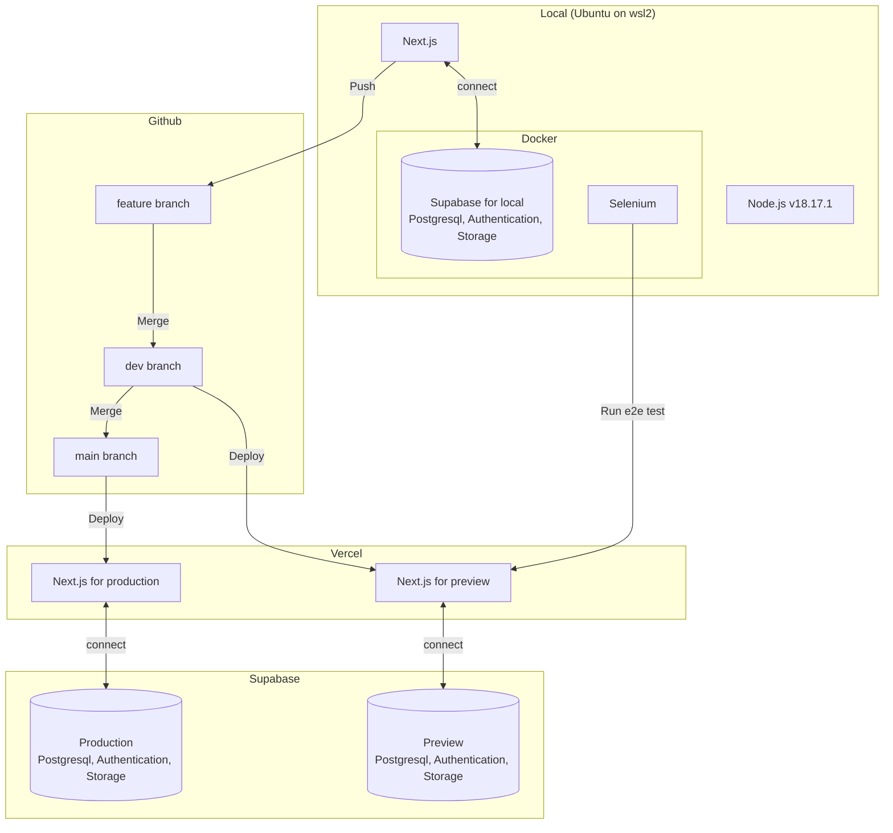

# LGTMeme
LGTMeme is a simple LGTM (Looks Good To Me) image creation service. You can quickly insert LGTM characters into your favorite image and copy markdown to the clipboard. Brighten up the monotonous code review and approval process with humorous LGTM image.

## URL

Production: https://lgtmeme.vercel.app

Preview: https://lgtmeme-git-dev-ucho456job.vercel.app

Storybook: https://ucho456job.github.io/LGTMeme

## Technologies

- Next.js v13.5.2
- React v18.2.0
- Node.js v18.17.1
- Typescript v5.2.2
- Prisma v5.5.2
- Supabase v2.36.0
- Panda css v0.17.5
- Storybook v7.4.3
- Jest v29.7.0
- Selenium v4.14.0
- Docker v24.0.6

## Architecture

## Wiki

[Quick start](https://github.com/ucho456job/LGTMeme/wiki/Quick-start)

[Storybook](https://github.com/ucho456job/LGTMeme/wiki/Storybook)

[Unit test](https://github.com/ucho456job/LGTMeme/wiki/Unit-test)

[E2E test](https://github.com/ucho456job/LGTMeme/wiki/E2E-test)

[Why I chose it](https://github.com/ucho456job/LGTMeme/wiki/Why-I-chose-it)
