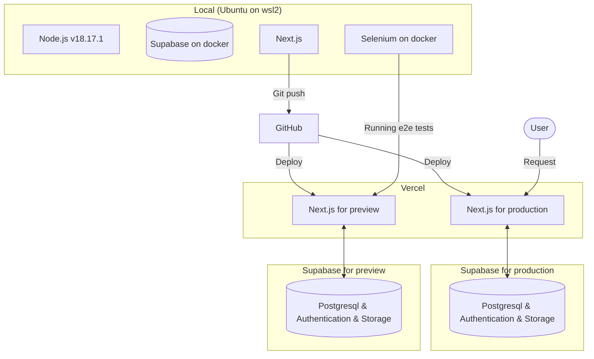

# LGTMeme
LGTMeme is a simple service for creating LGTM images. You can quickly insert the letters "LGTM" into your favorite images and copy the Markdown. Use humorous LGTM images to brighten up monotonous code reviews and approval processes.

## URL

Production: https://lgtmeme.vercel.app/

Preview: https://lgtmeme-git-dev-ucho456job.vercel.app/

Storybook: https://ucho456job.github.io/LGTMeme/

## Technologies

- Next.js v13.5.2
- React v18.2.0
- Node.js v18.17.1
- Typescript v5.2.2
- Prisma v5.5.2
- Supabase v2.36.0
- Panda css v0.17.5
- Storybook v7.4.3
- Jest v29.7.0
- Selenium v4.14.0
- Docker v24.0.6

## Architecture

## Wiki

[Getting start](https://github.com/ucho456job/LGTMeme/wiki/Getting-start)

[Running tests](https://github.com/ucho456job/LGTMeme/wiki/Running-tests)

[Reference the component catalog in Storybook](https://github.com/ucho456job/LGTMeme/wiki/Reference-the-component-catalog-in-Storybook)
